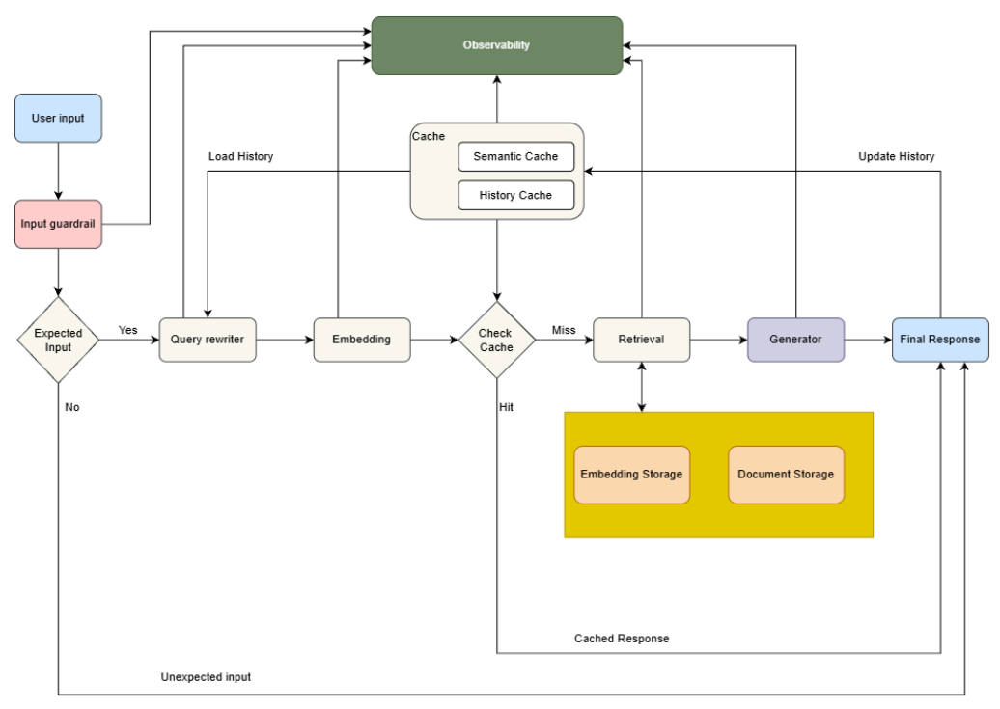

# RAG-Medical-Pipeline

**RAG-Medical-Pipeline** là một hệ thống **Retrieval-Augmented Generation (RAG)** chuyên biệt cho lĩnh vực y tế, được xây dựng hoàn toàn bằng tiếng Việt, tập trung vào việc cung cấp thông tin sức khỏe chính xác, an toàn và dựa trên tài liệu y khoa đáng tin cậy (Vinmec, WHO, Bộ Y tế Việt Nam, v.v.).

Hệ thống kết hợp:
- **Hybrid Retrieval** (Dense + BM25)
- **Semantic Cache** (Redis)
- **Input Guardrail** (an toàn, chống từ cấm, độc hại, injection)
- **Query Rewriting** (history-aware)
- **LLM Generation** (Groq + Qwen 32B)

## Sơ đồ pipeline tổng quát



## Tính năng chính

- **An toàn y tế cao**: Guardrail nghiêm ngặt (không chẩn đoán, không kê đơn, luôn có disclaimer).
- **Tìm kiếm hybrid**: Kết hợp vector search (bge-m3) + BM25 để recall tốt hơn với tiếng Việt.
- **Semantic Cache**: Tăng tốc và giảm chi phí inference khi query lặp lại hoặc tương tự (cosine similarity).
- **History-aware**: Rewrite query dựa trên lịch sử chat (Redis lưu session).
- **Observability**: Tích hợp Langfuse để trace latency, token usage, chi phí.
- **Config tập trung**: Tất cả settings nằm trong `config/settings.py` và `.env`.

## Công nghệ sử dụng (Tech Stack)

- **Backend**: Python 3.10+, FastAPI/Chainlit
- **LLM**: Groq (Qwen 32B hoặc model khác)
- **Embedding**: BAAI/bge-m3 (HuggingFace)
- **Vector Store**: Chroma (persistent)
- **Doc Store**: MongoDB
- **Keyword Retrieval**: BM25 (LlamaIndex)
- **Cache**: Redis (semantic + on-the-fly)
- **Guardrail**: Presidio/Stanza (PII), FastText (ngôn ngữ), Aho-Corasick (blocked keywords)
- **Observability**: Langfuse
- **Chat UI**: Chainlit
- **Container**: Docker + Docker Compose

## Cài đặt & Chạy

### Yêu cầu

- Python 3.10+
- Docker + Docker Compose (cho Redis & MongoDB)
- GPU (nếu dùng `device="cuda"`) hoặc CPU

### Bước cài đặt

1. Clone repo:
    ```bash
    git clone https://github.com/DuongNguyenTung2204/rag-project.git
    cd rag-project
    ```
2. Tạo virtual environment & cài dependencies: 
    ```bash
    python -m venv venv
    # Windows
    .\venv\Scripts\activate
    # Linux/Mac
    # source venv/bin/activate
    pip install -r requirements.txt
    ```
3. Tạo file .env từ .env.example và điền các giá trị:
    ```bash
    cp .env.example .env
    # Chỉnh sửa .env: GROQ_API_KEY, LANGFUSE keys, LANGFUSE url
    ```
4. Chạy Redis + MongoDB:
    ```bash
    docker-compose up -d
    ```
5. Download datasets
    ```bash
    python -m src.storage.load_datasets
    ```
6. Build vector database (tạo embedding + lưu vào ChromaDB):
    ```bash
    python -m src.storage.build_vector_db
    ```
7. Build BM25 index + lưu nodes vào MongoDB DocumentStore:
    ```bash
    python -m src.storage.build_mongo_docstore
    ```
8. Tải model FastText Language Identification (`lid.176.bin`):
   Model này dùng để detect ngôn ngữ (đặc biệt hữu ích cho hybrid RAG multilingual, lọc tiếng Việt, v.v.).  
   Chạy lệnh sau trong thư mục gốc project (rag-project):

   ```bash
   # Tạo thư mục nếu chưa có
   mkdir -p src/models

   # Tải model chính thức từ fastText (khoảng 128MB)
   wget https://dl.fbaipublicfiles.com/fasttext/supervised-models/lid.176.bin -O src/models/lid.176.bin
   ```
9. Chạy Chainlit:
    Khởi động ứng dụng bằng lệnh sau:

    ```bash
    chainlit run main.py -w
    ```
    Sau khi server khởi động thành công, mở trình duyệt và truy cập:

    http://localhost:8000