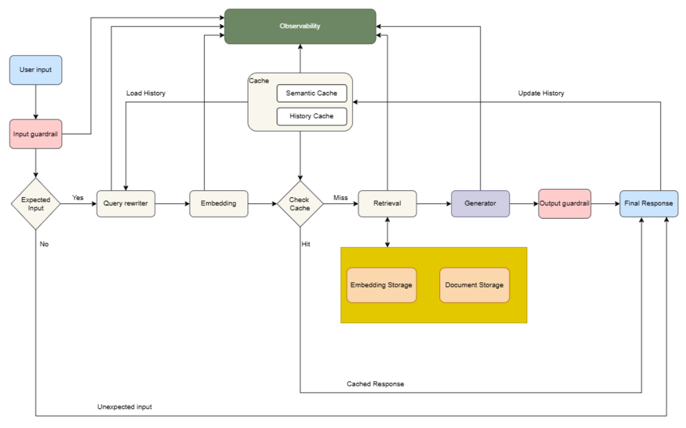

# RAG-Medical-Pipeline

**RAG-Medical-Pipeline** là hệ thống **Retrieval-Augmented Generation (RAG)** chuyên biệt cho lĩnh vực **y tế tiếng Việt**, được thiết kế với trọng tâm **an toàn cao**, **chính xác**, **dễ bảo trì** và **tuân thủ nghiêm ngặt chủ đề sức khỏe**.

Dự án sử dụng dữ liệu uy tín từ Vinmec và các nguồn Q&A y khoa, kết hợp **hybrid retrieval**, **query rewriting**, **semantic cache**, **guardrails đa tầng**, **Chainlit UI**, và **Langfuse observability** để mang lại trải nghiệm chatbot y tế đáng tin cậy, nhanh chóng và an toàn.

### Điểm nổi bật
- **An toàn y tế cao**: Guardrails input/output kiểm tra ngôn ngữ, từ cấm, toxicity, prompt injection, hallucination, leak...
- **Giao diện thân thiện**: Chainlit UI realtime, hiển thị lịch sử chat.
- **Observability chuyên sâu**: Langfuse trace toàn bộ pipeline.
- **Config linh hoạt**: Sử dụng `pydantic-settings` với `.env` và cấu trúc phân cấp rõ ràng.
- **Tối ưu tiếng Việt**: Embedding multilingual, BM25 không stemming.
- **Multi-turn conversation**: Query rewriting + Redis chat history.

## Tính năng chính

- **Hybrid Retrieval**: Pinecone (dense bge-m3) + BM25 (sparse) qua QueryFusionRetriever (RRF).
- **History-Aware Query Rewriting**: Groq small model viết lại query.
- **Semantic Cache**: Redis – cosine similarity ≥ 0.95, TTL 90 ngày.
- **Chat History**: RedisChatMessageHistory (session-based, TTL 7 ngày).
- **LLM Generation**: Groq **qwen/qwen3-32b** – temperature 0.4, max 4000 tokens.
- **Guardrails Input & Output**: fastText + Aho-Corasick + Groq LLM checks.
- **UI**: Chainlit – chatbot web realtime.
- **Observability**: Langfuse trace từng bước.
- **Config**: `pydantic-settings` với paths tuyệt đối, env vars, default values.

## Kiến trúc Pipeline (Full Flow)

1. **User Input** → Chainlit nhận tin nhắn → Input Guardrail.
2. **Semantic Cache** → Check Redis.
3. **Query Rewriting** (nếu có history) → Groq small model.
4. **Hybrid Retrieval** → Dense + Sparse → RRF fusion → format context.
5. **Generation** → PromptTemplate + context → Groq qwen3-32b.
6. **Output Guardrail** → Kiểm tra response.
7. **Caching** → Lưu response hợp lệ vào Redis.
8. **Response** → Gửi về Chainlit UI + lưu history.

## Công nghệ sử dụng (Tech Stack)

| Thành phần              | Công nghệ / Tool                                      | Ghi chú                                      |
|-------------------------|-------------------------------------------------------|----------------------------------------------|
| Framework RAG           | LlamaIndex                                            | Core orchestration                           |
| Embedding Model         | BAAI/bge-m3                                           | 1024d, multilingual, max 8192 tokens         |
| Vector DB (Dense)       | Pinecone                                              | index: vinmec-subtitle-rag-kaggle            |
| Document Store + BM25   | MongoDB + BM25Retriever                               | namespace: medical_rag_vi_2026               |
| Hybrid Fusion           | QueryFusionRetriever (RRF)                            | top_k_final=6                                |
| Semantic Cache & History| Redis + RedisChatMessageHistory                       | TTL cache 90 ngày, history 7 ngày            |
| Query Rewriting         | Groq API + small model (gpt-oss-20b)                  | Temperature thấp                             |
| LLM Generation          | Groq API + qwen/qwen3-32b                             | Temperature 0.4, max 4000 tokens             |
| Guardrails              | fastText + Aho-Corasick + Groq LLM                    | Input & Output – an toàn y tế cao            |
| UI                      | Chainlit                                              | Web-based realtime                           |
| Observability           | Langfuse                                              | Trace toàn pipeline                          |
| Configuration           | pydantic-settings                                     | Phân cấp, env file, paths tuyệt đối          |
| Dataset                 | urnus11/Vietnamese-Healthcare (HF)                    | 5 splits, ~341k nodes                        |
| Logging                 | Python logging                                        | Console/file, tắt noisy loggers              |

## Dataset

Nguồn dữ liệu chính: [urnus11/Vietnamese-Healthcare](https://huggingface.co/datasets/urnus11/Vietnamese-Healthcare) trên Hugging Face.  
Bộ dữ liệu bao gồm 5 splits chính:

- `vinmec_article_subtitle`: Các phần phụ (subtitle) của bài viết từ Vinmec.
- `medical_qa`: Cặp câu hỏi – trả lời y khoa từ nguồn uy tín.
- `full`: Phiên bản kết hợp của `vinmec_article_subtitle` và `medical_qa`.
- `vinmec_article_content`: Nội dung chi tiết của bài viết Vinmec.
- `vinmec_article_main`: Các phần chính (main section) của bài viết Vinmec.

Sau khi chunking, tổng số node khoảng **341.000** – đủ lớn để xây dựng hệ thống RAG y tế tiếng Việt chất lượng cao.

## Hạn chế hiện tại & Hướng phát triển

Dự án vẫn còn một số điểm có thể cải thiện trong tương lai:

- **Chưa tích hợp reranker** → Có thể thêm **bge-reranker** hoặc **Cohere Rerank** để tăng độ chính xác của kết quả retrieval.
- **Chưa có phần đánh giá (evaluation)** → Sắp tới sẽ triển khai **RAGAS**, **faithfulness**, **answer relevancy**, và benchmark trên tập dữ liệu y khoa tiếng Việt.
- **Chưa hỗ trợ stream response** → Sẽ bật `stream=True` trong Groq và tích hợp typing effect realtime trong Chainlit để trải nghiệm mượt mà hơn.
- **Deploy production** → Chuẩn bị Docker Compose + Nginx reverse proxy, kết hợp các dịch vụ cloud (Pinecone Serverless, MongoDB Atlas, Redis Cloud) để dễ scale và bảo trì.
- **Guardrail nâng cao** → Thêm phát hiện **PII (thông tin cá nhân)**, **watermarking** cho output, hoặc fine-tune mô hình guard riêng để tăng cường an toàn.